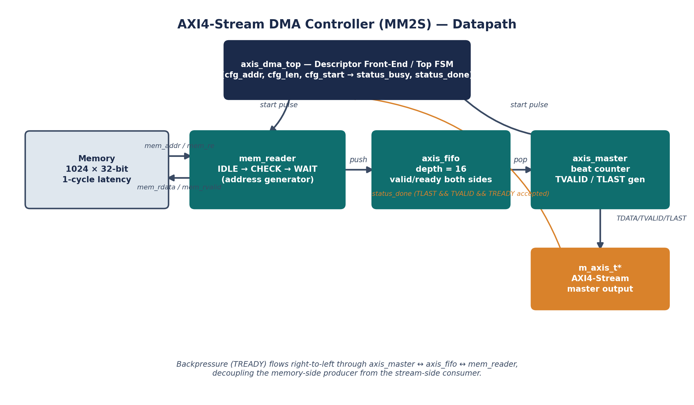
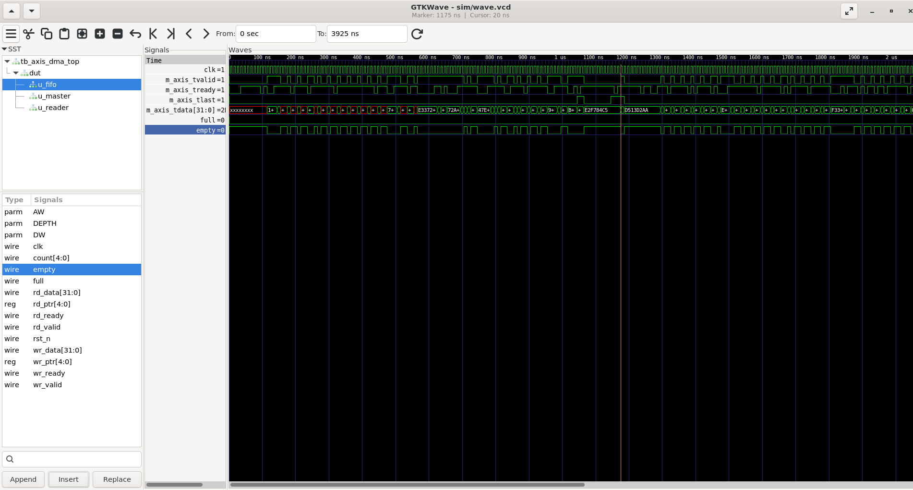

# AXI4-Stream DMA Controller (MM2S)

A descriptor-driven memory-to-stream DMA engine: it reads a contiguous block
out of memory and pushes it out over an AXI4-Stream master interface with
correct `TLAST` framing, decoupled by an internal FIFO so the memory side and
the stream side can run at different, independently-stalling rates. Written
in synthesizable Verilog-2001, simulated with Icarus Verilog.

[]()
[]()
[]()

## Architecture



* **`axis_dma_top`** is the descriptor front-end: it latches
  `cfg_addr`/`cfg_len` on `cfg_start`, issues a synchronized start pulse to
  both engines below, and reports `status_busy` / `status_done` (the latter
  tied to the *master* finishing — i.e. the last beat being accepted
  downstream, not just fetched from memory).
* **`mem_reader`** walks `cfg_len` sequential addresses starting at
  `cfg_addr`, issues one read at a time to a fixed-latency synchronous
  memory, and pushes each response into the FIFO. It only issues a new
  request when the FIFO reports a free slot, which is what keeps the design
  correct without needing an outstanding-transaction counter (see *Design
  notes* below).
* **`axis_fifo`** is a generic synchronous FIFO with `valid`/`ready` ports on
  both sides — i.e. it already speaks the AXI4-Stream handshake, so it drops
  straight into the datapath between the memory-side producer and the
  stream-side consumer and absorbs any rate mismatch / backpressure between
  them.
* **`axis_master`** drains the FIFO onto the external AXI4-Stream bus,
  asserting `TVALID` only while a transfer is active and computing `TLAST`
  from a beat counter so the sink can frame the burst.

Backpressure (`TREADY`) flows right-to-left through `axis_master` ↔
`axis_fifo` ↔ `mem_reader`, decoupling the memory-side producer from the
stream-side consumer — neither block needs to know how fast the other one
is.

## Module hierarchy

| File | Description |
|---|---|
| `rtl/axis_fifo.v` | Generic synchronous FIFO, binary read/write pointers, `valid`/`ready` handshake on both ports, parameterizable width and depth. |
| `rtl/mem_reader.v` | 3-state FSM (`IDLE -> CHECK -> WAIT`) that walks the address range, issues memory reads gated on FIFO space, and pushes responses into the FIFO. |
| `rtl/axis_master.v` | FIFO-to-AXI4-Stream passthrough with a beat counter that generates `TVALID`/`TLAST`. |
| `rtl/axis_dma_top.v` | Descriptor register front-end + integration of the three blocks above. |

## Interface (`axis_dma_top`)

| Port | Width | Dir | Description |
|---|---|---|---|
| `clk`, `rst_n` | 1 | in | Clock, active-low async reset |
| `cfg_start` | 1 | in | Pulse to launch a transfer |
| `cfg_addr` | `AW` | in | Source base address (word-addressed) |
| `cfg_len` | `LW` | in | Transfer length in beats |
| `status_busy` / `status_done` | 1 | out | Transfer in progress / one-cycle completion strobe |
| `mem_addr` / `mem_re` | `AW` / 1 | out | Memory read address & request strobe |
| `mem_rdata` / `mem_rvalid` | `DW` / 1 | in | Memory read data & response-valid (registered, 1-cycle fixed latency) |
| `m_axis_tdata/tvalid/tready/tlast` | — | — | Standard AXI4-Stream master interface |

## Verification

`tb/tb_axis_dma_top.v` is a self-checking testbench:

1. Instantiates a behavioural single-port synchronous memory (1024 x 32-bit,
   1-cycle read latency) and fills it with random data.
2. Drives a randomized `m_axis_tready` (~75% asserted) on the stream sink to
   exercise backpressure through the FIFO and the `mem_reader`'s flow
   control.
3. Runs four back-to-back transfers of varying address/length — including a
   1-beat edge case (`len = 1`, where `TLAST` must fire on the only beat) and
   a 64-beat burst that overflows the 16-entry FIFO multiple times over.
4. For each transfer, checks: the number of beats received equals `cfg_len`,
   every beat's data is bit-exact against `mem_array[addr + i]` **in order**,
   and `TLAST` is asserted on exactly the last beat and nowhere else.

### Proof of passing run

Latest run — 4 transfers, 114 beats total, 0 errors:

```
T1: addr=0   len=32 -> 32 beats checked
T2: addr=100 len=1  -> 1 beats checked
T3: addr=200 len=64 -> 64 beats checked
T4: addr=512 len=17 -> 17 beats checked
--------------------------------------------
axis_dma TB: 4 transfers, RESULT: PASS
--------------------------------------------
```

### Waveform proof (GTKWave)

Captured straight from the `sim/wave.vcd` produced by the run above —
`m_axis_tvalid`/`m_axis_tready`/`m_axis_tlast` framing each beat, plus the
FIFO's internal `full`/`empty` flags showing it absorbing the backpressure
the testbench injects:



## Running the simulation

Requires Icarus Verilog (`iverilog`/`vvp`). On Windows, run this from a WSL
Ubuntu terminal (`sudo apt install -y iverilog gtkwave`) or use the native
Windows build from [bleyer.org/icarus](https://bleyer.org/icarus/).

```bash
cd axi4_stream_dma
iverilog -g2005 -o sim/sim.vvp rtl/axis_fifo.v rtl/mem_reader.v \
         rtl/axis_master.v rtl/axis_dma_top.v tb/tb_axis_dma_top.v
vvp sim/sim.vvp
gtkwave sim/wave.vcd      # optional, to view the waveform interactively
```

## Design notes / trade-offs

* **Why gate on `fifo_wr_ready` before issuing, not an outstanding-counter:**
  the memory model has fixed 1-cycle latency and `mem_reader` only ever has
  one read in flight, so checking "is there a free slot" immediately before
  issuing is sufficient — nothing else can consume that slot before the
  response lands, since the reader is the FIFO's only writer. This keeps the
  flow-control logic to a single signal check instead of a credit counter.
* **Throughput trade-off (documented on purpose):** the one-request-at-a-time
  scheme costs roughly 3 cycles per beat on the memory side. A
  higher-bandwidth version would pipeline reads — track outstanding
  transactions with a counter sized to the memory's latency and gate new
  requests on `(FIFO free slots) > outstanding_count` — trading additional
  control complexity for throughput. That is exactly the kind of
  performance-vs-complexity call this project is meant to demonstrate
  thinking about.
* **`status_done` is tied to the stream master, not the memory reader:** the
  transfer is only "done" once the consumer has accepted the final beat
  (`TLAST && TVALID && TREADY`); the reader finishing only means the data has
  been fetched into the FIFO, which can lag behind under backpressure.
* **Natural extensions:** a scatter-gather descriptor ring (chained
  transfers without CPU intervention), `TKEEP`/`TSTRB` support for
  non-word-aligned final beats, a symmetric S2MM (stream-to-memory) path, and
  an interrupt/CSR block for a complete register-mapped peripheral.
